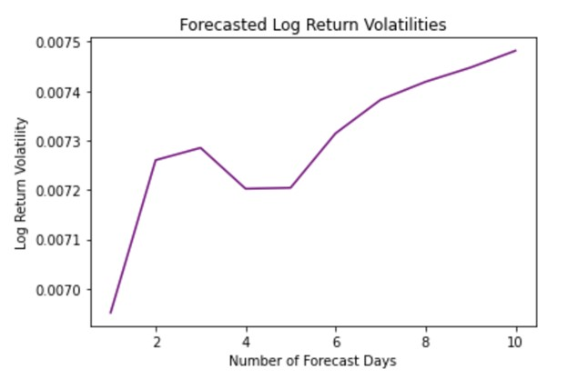

```{r,include=FALSE,warning=FALSE,message=FALSE}
#library("readxl")
library("ggplot2")
library('tidyverse')
library("grid")
library('gridExtra')
library("ggpubr")
library("rstatix")
library("pander")
library("tseries")
library("fGarch")
library("TSA")

```


```{r,include = F,warning = F, message = F}
# setting up graph theme

my_theme <- theme_bw()+
  theme(plot.title = element_text(hjust=0.5),
        axis.text.x = element_text(size=11),
        axis.text.y = element_text(size = 11,angle=45),
        axis.title = element_text(size = 13),
        plot.subtitle   = element_text(hjust=0.5),
        plot.caption = element_text(hjust = 0.5)
)

```


```{r,include = F}
# read the data set 

data_bitcoin <- read.csv2("BTC_USD.csv",header = T,skip=1,sep = ",")

```


```{r,include = F}
# adjusting data type of the volume and price 

data_bitcoin <- mutate(data_bitcoin,
               date = as.Date(date))

data_bitcoin$Volume.USDT <- as.numeric(data_bitcoin$Volume.USDT)
data_bitcoin$Volume.BTC <- as.numeric(data_bitcoin$Volume.BTC)
data_bitcoin$open <- as.numeric(data_bitcoin$open)
data_bitcoin$close <- as.numeric(data_bitcoin$close)

```


```{r, include = F}
data_bitcoin$log_return <- log(data_bitcoin$close/data_bitcoin$open)

```


# Introduction 

Bitcoin is a decentralized digital currency that can be sent from user to user on the Bitcoin network without a central bank. Studies have been focused on predicting its price and volatility. However, investors are mostly concerned about Bitcoin’s rate of return for their investments. With this in mind, our analysis mainly focuses on the daily log return of the Bitcoin price from August 2017 to June 2021. This study uses the log return on the ground that stock price is assumed to be log normally distributed, and we use a similar assumption for the Bitcoin price. 


## Daily Log Return 

```{r,echo= F}

ggplot(data_bitcoin,aes(x=date,y=log_return))+
  geom_line(color = "#00BFC4")+
  geom_line(aes(y = mean(log_return)),color = "#F8766D")+
  labs(title = "BTC Daily Log Return Since 2017",
       x = "Date",
       y = "Daily Log Return",
       caption = "Figure 1. Data souce: Binance ")+
  scale_x_date(date_breaks = "1 year",
                date_labels = "%Y %B")+
  my_theme

```

Figure 1 shows the daily log return of BTC in USD. From the plot, it seems that the return fluctuates around the mean daily log return, which is 0.157, shown as the red line. Although we cannot make a conclusion simply by looking at the plot, the BTC daily log return may have a seasonal pattern where it fluctuates around the mean within a seemingly fixed interval. It is worth pointing out that the change in variance of the data is obvious. Especially around January of 2020, the log return sharply dropped to -0.5 and soon recovered. To examine the seasonality and pick the suitable model, we need to look at the ACF and PACF plot. 


##  ACF and PACF plots 

```{r,include = F}

bitcoin_acf <- acf(data_bitcoin$log_return,
                   plot = F)

bitcoin_acf_df <- data.frame(lag = bitcoin_acf$lag,
                             acf = bitcoin_acf$acf)

signif_level<- qnorm((1 + 0.95)/2)/sqrt(sum(!is.na(data_bitcoin$log_return)))


```


```{r, echo= F}

ggplot(bitcoin_acf_df,aes(x = lag, y = acf))+
  geom_col(fill="#00BFC4")+
  geom_line(y = signif_level, 
            color = "#F8766D",
            linetype = 2)+
  geom_line(y = -signif_level,
            linetype = 2,
            color = "#F8766D")+
  labs(x="Lags", 
       title = "Autocorrelation of BTC Daily log Return",
       y = "Autocorrelation",
       caption = "Figure 2. Data Source: Binance")+
  my_theme

```

```{r,echo = F}
bitcoin_pacf <- pacf(data_bitcoin$log_return,
                     plot = F)

bitcoin_pacf_df <- data.frame(lag = bitcoin_pacf$lag,
                              pacf = bitcoin_pacf$acf)

```


```{r,echo = F}

ggplot(bitcoin_pacf_df,aes(x = lag, y = pacf))+
  geom_col(fill="#00BFC4")+
  geom_line(y = signif_level, 
            color = "#F8766D",
            linetype = 2)+
  geom_line(y = -signif_level,
            linetype = 2,
            color = "#F8766D")+
  labs(x="Lags", 
       title = "Partial Autocorrelation of BTC Daily log Return",
       y = "Partial Autocorrelation",
       caption = "Figure 3. Data Source: Binance")+
  my_theme

```

Figure 2 shows the autocorrelation plot of the BTC daily log return. The red lines mark the (+/-) significance level to check whether the ACF coefficient at a given time lag is significantly different from 0. An autocorrelation plot explains how the present value of the time series data is correlated with the past values under different time lags. By looking at the plot, there is no strong pattern of the significant ACF coefficients in a given fixed interval. Thus, we can conclude that there is not a strong seasonality in the BTC daily log return data.

Figure 3 shows the partial autocorrelation plot of the BTC daily log return. Similarly, the red line marks the (+/-) significance level to check whether the PACF coefficient at a given time lag is significantly different from 0. A Partial Autocorrelation plot shows the correlation between the parts of the present value of the time series data and the value of a given time lag that are not predicted by the values of the other time lags. To determine which model to fit, it is necessary to make sure that the given time series data is stationary. By 'stationary', it assumes that the mean, variance, and the autocorrelation of the given time series data do not change over time. To test for stationarity, we perform an Augmented Dickey-Fuller Test. 


```{r,warning= F,echo=F}
adf.test(data_bitcoin$log_return)

```

The test result shown above is an Augmented Dickey-Fuller (ADF) Test on stationarity. Based on the ADF Test, the Null hypothesis is that there is unit-root presented in the autoregression model. Having the unit-root is a sign that the time series data has a stochastic trend that introduces non-stationarity into the data. The Alternative hypothesis is that there is stationarity presented in the data. Since the p-value is 0.01, we reject the Null hypothesis that there is unit-root presented in the data, and we may conclude that the BTC daily log return is stationary. Thus, the ARMA model is suitable for the given time series data. To test if we need to implement a GARCH model, a Ljung-Box test is performed. 


## Test on Garch Effect 

```{r,include= F}
data_bitcoin$volatility_lreturn <- data_bitcoin$log_return - mean(data_bitcoin$log_return)
```

```{r, echo = F}
Box.test(data_bitcoin$volatility_lreturn,
         lag = 12,type = "Ljung") %>%
  pander()

```

The Null hypothesis of the Ljung-box test is that the first few lags of the ACF of the variance series are statistically zero. Based on the test above, we have a p-value 0.021 which is smaller than 0.05. Thus we reject the Null hypothesis and conclude that there is a GARCH effect in the given time series data. 

By Figure 2 and Figure 3, because of the wave shape of the ACF plot and that the first spike of PACF is statistically non-zero, we would consider AR(1), and ARMA(1,1). To pick the order of the GARCH model, we plot the EACF to find the candidates. 

```{r,echo= FALSE, fig.cap= "EACF Table"}
eacf(data_bitcoin$log_return)

```

Based on the EACF table, we would consider the GARCH(2,1) and GARCH(1,2) models. 


## Model Estimation

```{r,warning= F, message= F,echo= F}
ag0121 <- garchFit(~arma(0,1)+garch(2,1),
                          data = data_bitcoin$log_return,
                          cond.dist = "norm",trace = F)
summary(ag0121)

```


```{r,message=F, warning= F, echo= F}
ag0112<- garchFit(~arma(0,1)+garch(1,2),
                          data = data_bitcoin$log_return,
                          cond.dist = "norm",trace = F)
summary(ag0112)
```

```{r,message=F, warning= F, echo= F}
ag1121<- garchFit(~arma(1,1)+garch(2,1),
                          data = data_bitcoin$log_return,
                          cond.dist = "norm",trace = F)
summary(ag1121)
```

```{r,message=F, warning= F, echo= F}
ag1112 <- garchFit(~arma(1,1)+garch(1,2),
                          data = data_bitcoin$log_return,
                          cond.dist = "norm",trace = F)
summary(ag1112)

```
From the Information Criterion Statistics, we can make comparisons between the models by measuring the prediction error based on Akaike Information Criterion (AIC) score. By comparing the AIC score of the fitted models, the ARMA(0,1)+GARCH(1,2) is preferred. 


## The Selected Model and Model diagnostic 


```{r,echo=F}
plot(ag0112,which = 13)

```

From the QQ plot, we see that on both of the tails, the data points largely deviate from the normality line. This implies that the normality assumption of the GARCH model on its residuals may be violated. 


```{r, echo= F}

summary(ag0112)

```

The results of Jarque-Bera Test and Shapiro-Wilk Test also confirm the observation based on the QQ plot. Both of the tests have the Null hypothesis of normality. By rejecting the Null hypothesis, the Normality assumption does not hold for the ARMA-GARCH model that we fit. Considering that the sum of beta1 and alpha1 is smaller than 1, the choice of ARMA-GARCH model itself is a good fit for the data. An ARMA-GARCH model that relies on non-normal conditional distribution assumptions may be considered. 

# t and Skewed t distribution

```{r,warning= F, message= F, echo= F}

ag0112_std <- garchFit(~arma(0,1)+garch(1,2),
                          data = data_bitcoin$log_return,
                          cond.dist = "std",trace = F)

summary(ag0112_std)


```

```{r,echo=F}
plot(ag0112_std, which = 13)


```

```{r,message=F, warning=F, echo= F}

ag0112_sstd <- garchFit(~arma(0,1)+garch(1,2),
                          data = data_bitcoin$log_return,
                          cond.dist = "sstd",trace = F)

summary(ag0112_sstd)

```

```{r,echo=F}

plot(ag0112_sstd,which = 13)


```

Although we see a better QQ plot for both the t-distribution and the skewed t-distribution ARMA-GARCH models, the Ljung-Box test on Q(10) has rejected its Null Hypothesis, meaning that there is at least one autocorrelation greater than zero between the residuals for a set of time lags. In the other words, both of the models do not fully capture the autocorrelation from the data. Thus, although the two models have a better qqplot, the ARMA GARCH model under the normal conditional distribution will be used in forecasting. 


## Prediction

```{r,echo=F}

ag_forcast <- predict(ag0112,n.ahead = 10)

BTC_Vf <- data.frame(volatility = ag_forcast$standardDeviation,
                     day = c(1:10))

```


```{r,echo=F}
ggplot(BTC_Vf, aes(x = day, y = volatility))+
  geom_line(color = "#ff9933")+
  labs(x = "Day of prediction",
       y = "volatility prediction",
       title = "Prediction of BTC log return Volatility",
       subtitle = "Derived from ARMA(0,1)+GARCH(1,2)")+
  
  my_theme

```
```{r,echo=F}
data_bitcoin$fitted <- ag0112@fitted

ggplot(data_bitcoin, aes(x= date, y = fitted))+
  geom_line(color = "#ff9933")+
  labs(y = "Fitted log return",
       x = "Date",
       title = "Fitted Value for BTC Daily log Return")+
  my_theme
  


```

From both of the plots, the volatility of BTC Daily Log Return is continuously increasing in recent days, and it is going to keep increasing for at least the next ten days. Because of the dissatisfication of the assumptions for ARMA-GARCH model, some other types of models may be considered for a more accurate prediction on Bitcoin properties. An alternative model would be the LSTM model. 


## LSTM

Long Short Term Memory networks (LSTMs) see ubiquitous use in processing and making predictions based on time series data and are designed to extend standard Recurrent Neural Networks (RNNs) by avoiding the long-term dependency problem. Standard RNNs, though capable of connecting previous information to the present task, struggle to connect this previous information if presented too far in the past due to vanishing or exploding gradients in the propagation. The LSTM consists of input, hidden, and output layers, where the fully self-connected hidden layer avoids the long-term dependency problem with its memory cells that guarantee constant error flow within their constant error carousels (CECs). The information encoded in the cell states is carefully regulated by three gates: the input, output, and forget gates, which provide continuous analogues of write, read, and reset operations. Through these gates, a cell state’s relevance in predicting the next value can be continuously updated. The combination of LSTM memory cells’ constant error flow and the three gate operations allow us to make long-term dependent predictions, independent of stationarity or distribution assumptions. 

In our LSTM model to predict and forecast BTC daily log return volatilities, we utilized PyTorch’s LSTM class and Adam optimizer, with a hidden size of 70, sequence length of 5, and a learning rate of 4e-5. Then, we split the data 70-30 so that the model could be trained on the first 70% of the log returns to predict the last 30% of the log returns. After training for 8000 epochs, we obtained a training loss of 0.000236815 and prediction loss of 0.002121. Finally, we forecasted 10 days of log return volatilities by feeding the last sequence of the data back into the model to obtain another prediction, appending this prediction to the sequence, and removing the head of the sequence to obtain another sequence of the same length, which can then be used to obtain further predictions in a similar manner. Below are plots of the LSTM prediction and forecast results:

 



## Discussion

Because of the dissatisfaction of the assumptions for Bitcoin modeling that is generally used in the stock market, it is likely that the Bitcoin price would have a different mechanism from that of the stocks. Thus, some other types of models may be considered for a more accurate prediction on Bitcoin properties. Moreover, the coefficients that we chose for the ARMA-GARCH model is not absolute. We used no more than 2 time lag in the model, ARMA(0,1)-GARCH(1,2), but 2 or more time lag is still possible to have a better fit to the given data. 


## Conclusion

Based on the results of the two models, the volatility of the Bitcoin daily log return is continuously increasing. Since there were certain assumptions that do not hold for the ARMA-GARCH model we picked, we would agree that our forecast would not be the most accurate one. However, the result of the LSTM model confirms our conclusion. Considering the Chinese government's action against the Bitcoin market in the past few weeks and the fact that China is one of the biggest markets for cryptocurrency, the prediction we have made seems plausible. Thus, we conclude that the daily Bitcoin log return becomes more volatile; and considering its importance to the cryptocurrency market, the market itself may become more volatile. 

<span style="color:blue"> Note: All codes are set as echo = FALSE and are not shown in the report </span>
